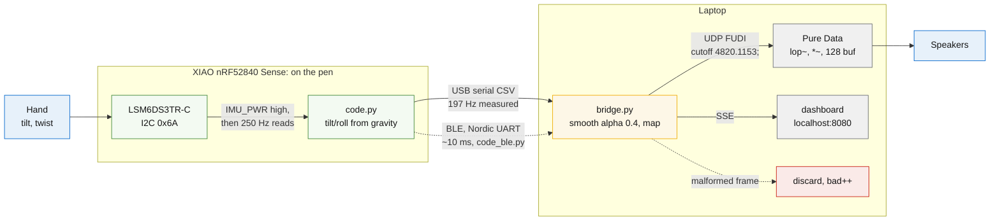
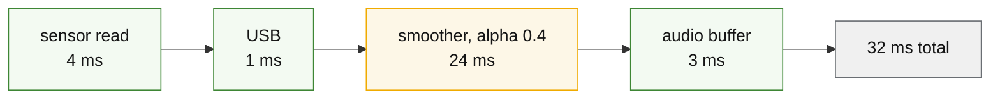
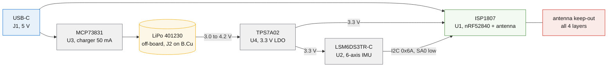

# Architecture: Pen Mixer on the XIAO nRF52840 Sense

## Context

Pen Mixer is a pen-mounted motion controller. Tilt the pen and a filter sweeps
across whatever track is playing on the laptop; twist it and the level moves.
This repo is the product build: the Sense board carries a 6-axis IMU and
Bluetooth on one 21 x 17.5 mm board, so real pen movement drives the audio.

A companion repo, [pen-mixer-rp2040](https://github.com/Brillar0101/pen-mixer-rp2040),
runs the same laptop-side stack from a board with no motion sensor, using
capacitive touch as a stand-in. The two repos together separate "is the
pipeline right" from "is the sensor right", and everything downstream of the
firmware is byte-identical between them.

Numbers in this document are measured on the working rig, not estimated.
Where something is estimated or unverified it says so.

## Components

| Component | Responsibility | Where it runs |
|-----------|----------------|---------------|
| LSM6DS3TR-C | 6-axis IMU, tilt and roll from gravity | on the board, I2C 0x6A |
| `code.py` | reads the IMU, emits CSV frames | CircuitPython on the board |
| `bridge.py` | parse, smooth, map, fan out | laptop, stdlib only |
| Pure Data | applies filter and gain to the playing track | laptop |
| `dashboard.py` | live view of every channel | laptop, port 8080 |

The frame format is the contract between firmware and everything else:

```
tilt,roll,energy
14.44,88.63,0.146
```

Both repos emit it, which is why the laptop side never changes between builds.

## Signal topology



The bridge is the gold box because it holds all the tuning: the smoother, the
mapping, and both outputs. Malformed frames take the red edge, get discarded,
and increment a counter the dashboard shows. If `bad` climbs, something
upstream broke.

The measured 197 Hz against a 250 Hz target is USB scheduling plus
CircuitPython's `print()` overhead. It has not caused problems.

## Latency budget



Past roughly 20 ms end to end, the connection between moving your hand and
hearing the change breaks and it stops feeling like an instrument. Smoothing
is the gold box because it eats 24 of the 32 ms and it is the only term you
can change freely. Measured settling to 95% of a step at 250 Hz:

| alpha | settles in | feel |
|---|---|---|
| 0.05 | 236 ms | unusable |
| 0.15 | 76 ms | visibly behind your hand |
| 0.4 | 24 ms | the default |
| 0.5 | 20 ms | snappier, more jitter through |
| 1.0 | 0 ms | raw, audible clicks on the filter |

A one-pole filter picks one setting for both fast and slow motion. A one-euro
filter adapts, and that is the right upgrade once the mapping stops changing.

## Mapping

| Gesture | From | Drives | Curve |
|---|---|---|---|
| Tilt forward and back | accelerometer pitch | filter cutoff, 80 Hz to 12 kHz | exponential |
| Twist the barrel | accelerometer roll | gain, 0.25x to 1.75x | linear |
| Move fast | acceleration magnitude | effect send, 0 to 1 | linear |

Frequency is perceived logarithmically, so the cutoff mapping is exponential.
A linear sweep spends most of its travel where the ear barely registers it.

Tilt and roll come from the gravity vector, so they are absolute and do not
drift. There is no sensor fusion to write.

## Production board

The custom PCB is a separate KiCad project: 13 x 35 mm, four layers, 0.8 mm,
all SMD.



The cell cannot feed the module directly: it runs to 4.2 V and the module's
ceiling is 3.6 V, so power returns through the LDO. The keep-out is red
because it is the constraint that decides the board's shape: no copper on any
layer at that end, or the antenna detunes and range collapses.

## Key decisions

### The ISP1807 module, not a bare nRF52840

The module carries the radio, matching network and antenna, plus modular
FCC/CE certification the host product inherits. A bare chip means owning RF
matching, antenna design and certification testing, which runs to five
figures. One wiring detail worth its own sentence: pin 20 (OUT_ANT) must be
tied to pin 22 (OUT_MOD) on the application PCB, or the radio has no antenna.

The ISP1807 land pattern is JLCPCB's official one (their EasyEDA library),
swapped in after a pad-for-pad comparison confirmed it matches the vendor
geometry exactly: all 78 pads, same numbering, same sizes, same positions.

### FUDI over UDP, not OSC

Pd's `netreceive` parses plain text natively, so there are no OSC externals
to install and the bridge stays stdlib-only. The cost is that nothing
validates message names; a typo in the patch fails silently.

### Local WAV for demos, BlackHole for live audio

The Spotify API never exposes the raw audio stream, and the Web Playback SDK
runs in a protected context you cannot tap for DSP. Demos that must not fail
use `readsf~` on a local WAV. Live audio routes Spotify's output through a
virtual driver (BlackHole) into Pd, which matches what the finished product
does. BlackHole needs `sudo killall coreaudiod` after install before
CoreAudio will list it.

### X/Y position is out of scope

Position on the page needs an optical sensor held at a fixed height and angle
to the paper. A hand-held pen changes both constantly, which makes the mount
the hard engineering problem. Tilt, twist and motion energy give four usable
channels without it.
