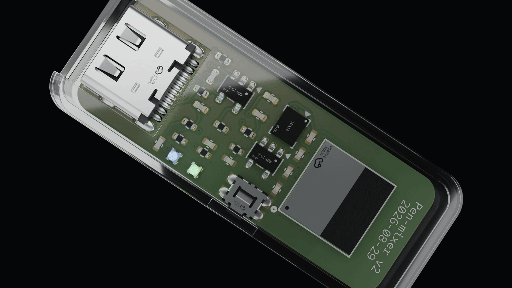
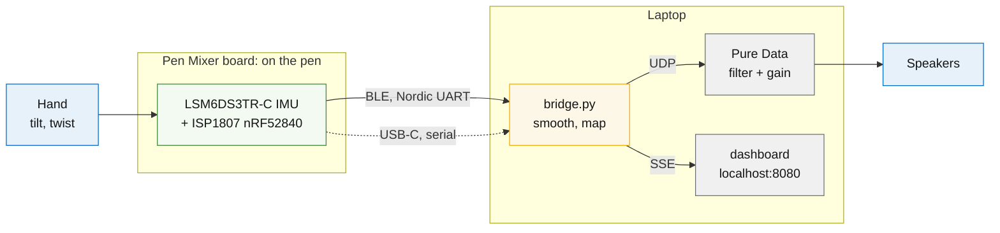

# Pen Mixer

Pen Mixer is a small motion controller that clips onto the top of an ordinary
pen and turns handwriting gestures into live audio control. An IMU on the
board reads tilt and twist, an nRF52840 sends the motion to a laptop over
Bluetooth, and the laptop shapes whatever track is playing: tilt the pen and
a filter sweeps, twist it and the level moves. The better your pen control
gets, the better your mix sounds.

<p align="center">
  
</p>

<p align="center"><em>The v2.1 board (13 &times; 35 mm) in its clear case</em></p>


This repo holds the whole project: prototype firmware, production firmware and
laptop stack, and the production PCB as a KiCad project.



## The hardware

The production board is a 13 x 35 mm, four-layer, 0.8 mm PCB, all SMD, designed
to ride on a pen barrel with a 401230 LiPo at the back of the pen.

| Ref | Part | Role |
|---|---|---|
| U1 | ISP1807 | nRF52840 with integrated antenna, pre-certified |
| U2 | LSM6DS3TR-C | 6-axis IMU |
| U3 | MCP73831 | LiPo charger, 50 mA |
| U4 | TPS7A02 | 3.3 V LDO, 200 nA quiescent |
| J1 | USB-C 16P | charge, programming, serial |
| J2 | pads on B.Cu | off-board LiPo, 401230 |

The KiCad project lives in `production/`. Schematic PDF, board plots, a render
and the BOM are in `production/output/`.

The board is fully routed and fabrication-ready: 0 unrouted connections,
ground pours on all four layers, and a clean DRC. U1 sits on the official
JLCPCB land pattern with part-for-part verified pad geometry, and every
component carries the 3D model of the exact part being ordered.

Every pinout came from a primary datasheet, kept in `production/datasheets/`.
The one that would have cost a board spin: ISP1807 pin 20 (OUT_ANT) must be
tied to pin 22 (OUT_MOD) on the application PCB, or the radio has no antenna.

## The firmware and laptop stack

`prototype/` runs on the Seeed XIAO nRF52840 Sense today and targets the
custom board unchanged, since both are an nRF52840 with an ST IMU on I2C.

```
prototype/
  bridge.py           serial or BLE, then smoothing, mapping, UDP, dashboard
  ble_source.py       laptop-side BLE client for --ble
  dashboard.py        live web view on :8080
  firmware/
    code.py           IMU over USB serial
    code_ble.py       IMU over BLE, advertises as PenMixer
  patches/            Pure Data: track playback, manual sliders, live input
```

How to run all of it, from firmware to Pure Data to the dashboard, lives in
[docs/RUNNING.md](docs/RUNNING.md).

## Measured, not estimated

| What | Number |
|---|---|
| Frame rate over USB | 197 Hz against a 250 Hz target |
| Frames in the soak run | 105,872, 0 malformed |
| Smoother settling, alpha 0.4 | 24 ms to 95% of a step |
| End-to-end budget | 32 ms, against ~20 ms where feel degrades |
| BLE vs USB link cost | ~10 ms vs 1 ms |

## Layout

```
prototype/            nRF52840 Sense build: real IMU, USB or BLE, laptop stack
app/                  Qt desktop app: 3-band EQ, visualizer, one-window stack
                      (start instructions for macOS and Windows: app/README.md)
production/           the production board
  kicad/              KiCad 10 project, footprints, 3D models
  datasheets/         primary sources for every pinout
  output/             schematic PDF, board plots, render, BOM, DRC report
docs/                 architecture, run guide, requirements (PRD)
ARCHITECTURE.md       how it all fits together, with diagrams
```

## License

MIT. See [LICENSE](LICENSE).

Built by Barakaeli ([Brillar0101](https://github.com/Brillar0101)) and
Lexy ([vnllagoldfish](https://github.com/vnllagoldfish)).
