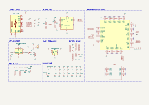
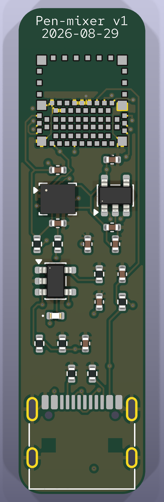
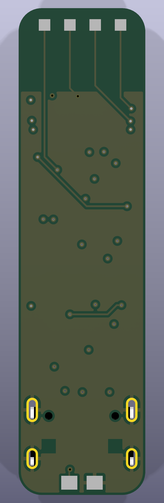
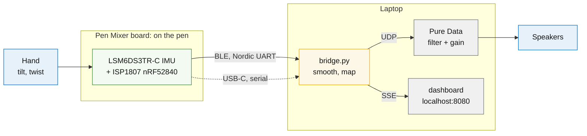

# Pen Mixer

Pen Mixer is a small motion controller that clips onto the top of an ordinary
pen and turns handwriting gestures into live audio control. An IMU on the
board reads tilt and twist, an nRF52840 sends the motion to a laptop over
Bluetooth, and the laptop shapes whatever track is playing: tilt the pen and
a filter sweeps, twist it and the level moves. The better your pen control
gets, the better your mix sounds.

<p align="center">
  
</p>

<p align="center">
  
  &nbsp;&nbsp;&nbsp;&nbsp;
  
</p>

<p align="center"><em>Schematic rev 0.3 &middot; board front and back, 11 &times; 42 mm, 4-layer</em></p>

This repo holds the whole project: prototype firmware, production firmware and
laptop stack, and the production PCB as a KiCad project.



## The hardware

The production board is an 11 x 42 mm, four-layer, 0.6 mm PCB, all SMD, designed
to ride on a pen barrel with a 401230 LiPo at the back of the pen.

| Ref | Part | Role |
|---|---|---|
| U1 | ISP1807 | nRF52840 with integrated antenna, pre-certified |
| U2 | LSM6DS3TR-C | 6-axis IMU |
| U3 | MCP73831 | LiPo charger, 50 mA |
| U4 | TPS7A02 | 3.3 V LDO, 200 nA quiescent |
| J1 | USB-C 16P | charge, programming, serial |
| J2 | pads on B.Cu | off-board LiPo, 401230 |

The KiCad project lives in `production/`. Schematic PDF, board plots, a render
and the BOM are in `production/output/`.

Two items block fabrication, deliberately:

1. **Routing.** 53 connections are unrouted. Power and ground come from the
   pours; what remains is USB as a differential pair, I2C, two interrupts, the
   analog pair and SWD. An evening in the interactive router.
2. **The ISP1807 land pattern is reconstructed**, not vendor-supplied. Pad
   numbering is read from the datasheet figure and is correct; the coordinates
   are derived from the dimensional drawing. On a 0.65 mm pitch 78-pad LGA,
   diff it against Insight SiP's official land pattern before paying for
   fabrication.

Every pinout came from a primary datasheet, kept in `production/datasheets/`.
The one that would have cost a board spin: ISP1807 pin 20 (OUT_ANT) must be
tied to pin 22 (OUT_MOD) on the application PCB, or the radio has no antenna.

## The firmware and laptop stack

`prototype/` runs on the Seeed XIAO nRF52840 Sense today and targets the
custom board unchanged, since both are an nRF52840 with an ST IMU on I2C.

```
prototype/
  bridge.py           serial or BLE, then smoothing, mapping, UDP, dashboard
  ble_source.py       laptop-side BLE client for --ble
  dashboard.py        live web view on :8080
  firmware/
    code.py           IMU over USB serial
    code_ble.py       IMU over BLE, advertises as PenMixer
  patches/            Pure Data: track playback, manual sliders, live input
```

How to run all of it, from firmware to Pure Data to the dashboard, lives in
[docs/RUNNING.md](docs/RUNNING.md).

## Measured, not estimated

| What | Number |
|---|---|
| Frame rate over USB | 197 Hz against a 250 Hz target |
| Frames in the soak run | 105,872, 0 malformed |
| Smoother settling, alpha 0.4 | 24 ms to 95% of a step |
| End-to-end budget | 32 ms, against ~20 ms where feel degrades |
| BLE vs USB link cost | ~10 ms vs 1 ms |

## Layout

```
prototype/            nRF52840 Sense build: real IMU, USB or BLE, laptop stack
production/           KiCad 10 project, the production board
  pen-mixer.pretty/   custom footprints
  datasheets/         primary sources for every pinout
  output/             schematic PDF, board plots, render, BOM, DRC report
docs/                 architecture, run guide, requirements (PRD)
ARCHITECTURE.md       how it all fits together, with diagrams
```

